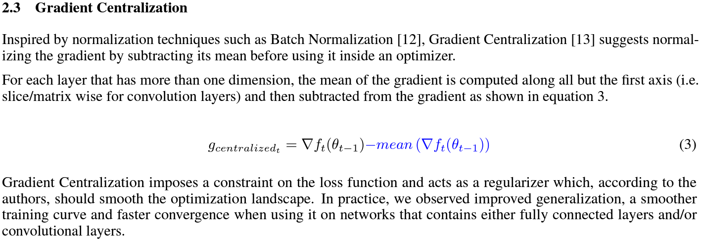
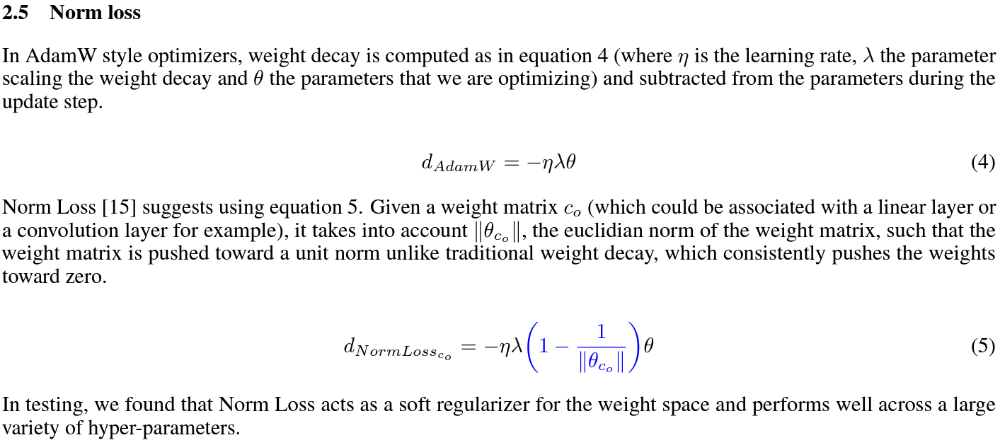
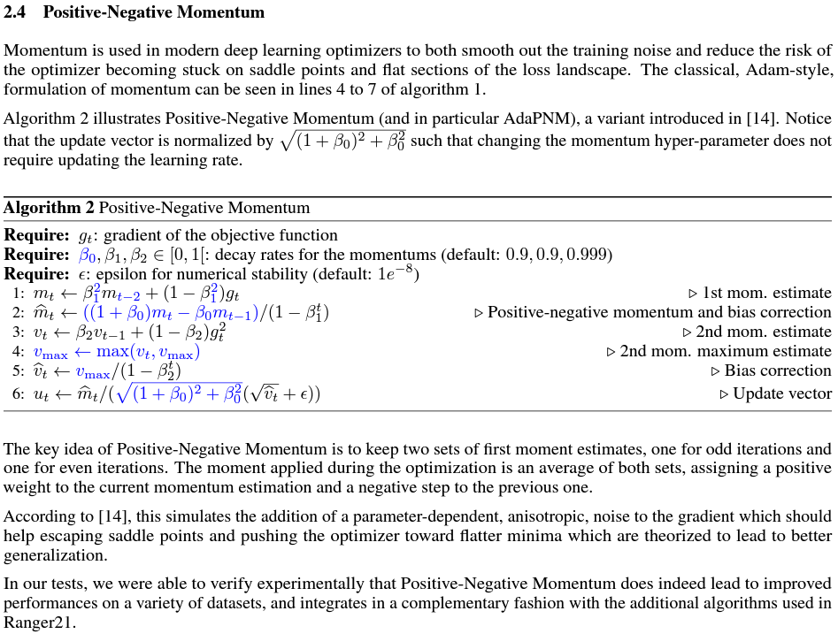
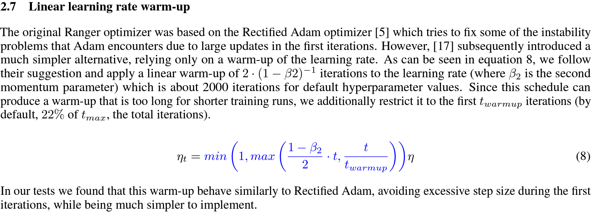
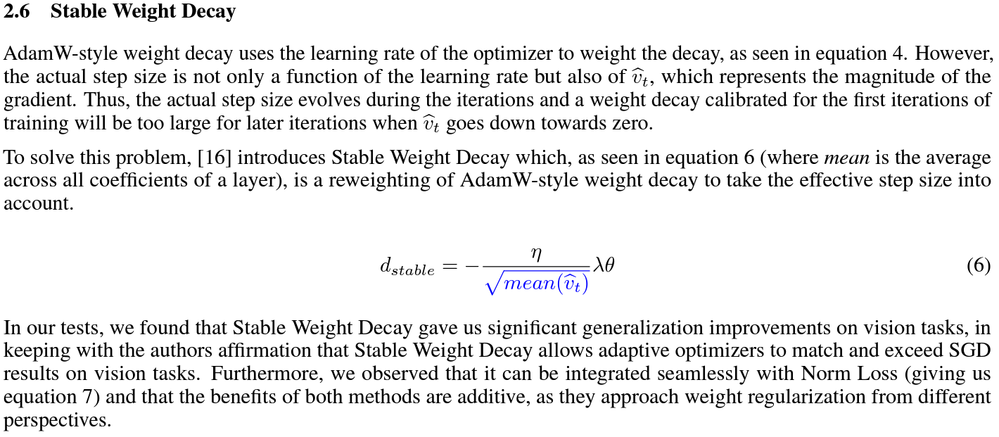
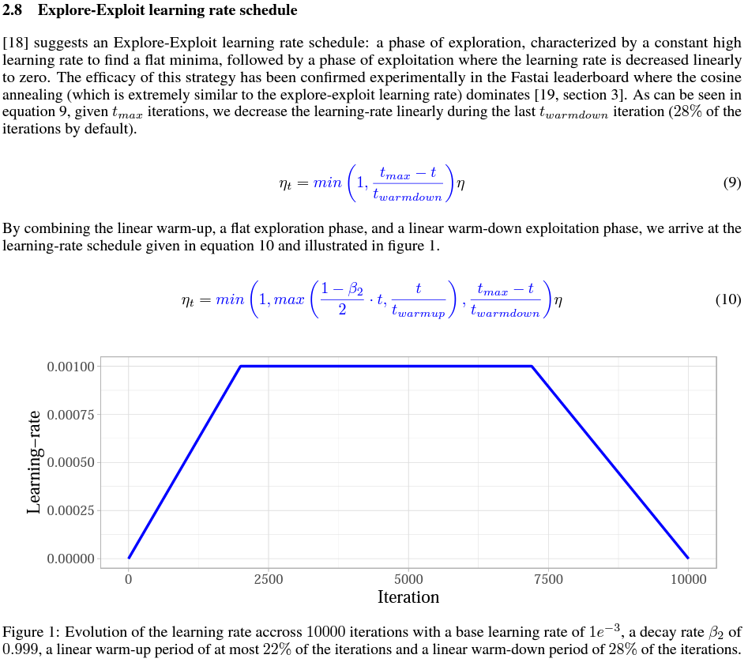

# pytorch-optimizer

 [](https://badge.fury.io/py/pytorch-optimizer)

Bunch of optimizer implementations in PyTorch with clean-code, strict types. Highly inspired by [pytorch-optimizer](https://github.com/jettify/pytorch-optimizer).

## Usage

### Install

```
$ pip3 install pytorch-optimizer
```

### Simple Usage

```
from pytorch_optimizer import Ranger21

...
model = YourModel()
optimizer = Ranger21(model.parameters())
...

for input, output in data:
  optimizer.zero_grad()
  loss = loss_function(output, model(input))
  loss.backward()
  optimizer.step()
```

## Supported Optimizers

| Optimizer | Description | Official Code | Paper |
| :---: | :---: | :---: | :---: |
| AdaBound | *Adaptive Gradient Methods with Dynamic Bound of Learning Rate* | [github](https://github.com/Luolc/AdaBound/blob/master/adabound/adabound.py) | [https://openreview.net/forum?id=Bkg3g2R9FX](https://openreview.net/forum?id=Bkg3g2R9FX) |
| AdaHessian | *An Adaptive Second Order Optimizer for Machine Learning* | [github](https://github.com/amirgholami/adahessian) | [https://arxiv.org/abs/2006.00719](https://arxiv.org/abs/2006.00719) |
| AdamP | *Slowing Down the Slowdown for Momentum Optimizers on Scale-invariant Weights* | [github](https://github.com/clovaai/AdamP) | [https://arxiv.org/abs/2006.08217](https://arxiv.org/abs/2006.08217) |
| MADGRAD | *A Momentumized, Adaptive, Dual Averaged Gradient Method for Stochastic* | [github](https://github.com/facebookresearch/madgrad) | [https://arxiv.org/abs/2101.11075](https://arxiv.org/abs/2101.11075) |
| RAdam | *On the Variance of the Adaptive Learning Rate and Beyond* | [github](https://github.com/LiyuanLucasLiu/RAdam) | [https://arxiv.org/abs/1908.03265](https://arxiv.org/abs/1908.03265) |
| Ranger | *a synergistic optimizer combining RAdam and LookAhead, and now GC in one optimizer* | [github](https://github.com/lessw2020/Ranger-Deep-Learning-Optimizer) | |
| Ranger21 | *a synergistic deep learning optimizer* | [github](https://github.com/lessw2020/Ranger21) | [https://arxiv.org/abs/2106.13731](https://arxiv.org/abs/2106.13731) |

## Useful Resources

Several optimization ideas to regularize & stabilize the training. Most of the ideas are applied in `Ranger21` optimizer.

Also, most of the captures are taken from `Ranger21` paper.

### Adaptive Gradient Clipping (AGC)

This idea originally proposed in `NFNet (Normalized-Free Network)` paper. 
AGC (Adaptive Gradient Clipping) clips gradients based on the `unit-wise ratio of gradient norms to parameter norms`.

* github : [code](https://github.com/deepmind/deepmind-research/tree/master/nfnets)
* paper : [arXiv](https://arxiv.org/abs/2102.06171)

### Gradient Centralization (GC)



Gradient Centralization (GC) operates directly on gradients by centralizing the gradient to have zero mean.

* github : [code](https://github.com/Yonghongwei/Gradient-Centralization)
* paper : [arXiv](https://arxiv.org/abs/2004.01461)

### Softplus Transformation

By running the final variance denom through the softplus function, it lifts extremely tiny values to keep them viable.

* paper : [arXiv](https://arxiv.org/abs/1908.00700)

### Gradient Normalization

### Norm Loss



* paper : [arXiv](https://arxiv.org/abs/2103.06583)

### Positive-Negative Momentum



* github : [code](https://github.com/zeke-xie/Positive-Negative-Momentum)
* paper : [arXiv](https://arxiv.org/abs/2103.17182)

### Linear learning-rate warm-up



* paper : [arXiv](https://arxiv.org/abs/1910.04209)

### Stable weight decay



* github : [code](https://github.com/zeke-xie/stable-weight-decay-regularization)
* paper : [arXiv](https://arxiv.org/abs/2011.11152)

### Explore-exploit learning-rate schedule



* github : [code](https://github.com/nikhil-iyer-97/wide-minima-density-hypothesis)
* paper : [arXiv](https://arxiv.org/abs/2003.03977)

### Lookahead

`k` steps forward, 1 step back. `Lookahead` consisting of keeping an exponential moving average of the weights that is 
updated and substituted to the current weights every `k_{lookahead}` steps (5 by default).

* github : [code](https://github.com/alphadl/lookahead.pytorch)
* paper : [arXiv](https://arxiv.org/abs/1907.08610v2)

### Chebyshev learning rate schedule

Acceleration via Fractal Learning Rate Schedules

* paper : [arXiv](https://arxiv.org/abs/2103.01338v1)

## Citations

<details>

<summary>AdamP</summary>

```
@inproceedings{heo2021adamp,
    title={AdamP: Slowing Down the Slowdown for Momentum Optimizers on Scale-invariant Weights},
    author={Heo, Byeongho and Chun, Sanghyuk and Oh, Seong Joon and Han, Dongyoon and Yun, Sangdoo and Kim, Gyuwan and Uh, Youngjung and Ha, Jung-Woo},
    year={2021},
    booktitle={International Conference on Learning Representations (ICLR)},
}
```

</details>

<details>

<summary>Adaptive Gradient Clipping (AGC)</summary>

```
@article{brock2021high,
  author={Andrew Brock and Soham De and Samuel L. Smith and Karen Simonyan},
  title={High-Performance Large-Scale Image Recognition Without Normalization},
  journal={arXiv preprint arXiv:2102.06171},
  year={2021}
}
```

</details>

<details>

<summary>Chebyshev LR Schedules</summary>

```
@article{agarwal2021acceleration,
  title={Acceleration via Fractal Learning Rate Schedules},
  author={Agarwal, Naman and Goel, Surbhi and Zhang, Cyril},
  journal={arXiv preprint arXiv:2103.01338},
  year={2021}
}
```

</details>

<details>

<summary>Gradient Centralization (GC)</summary>

```
@inproceedings{yong2020gradient,
  title={Gradient centralization: A new optimization technique for deep neural networks},
  author={Yong, Hongwei and Huang, Jianqiang and Hua, Xiansheng and Zhang, Lei},
  booktitle={European Conference on Computer Vision},
  pages={635--652},
  year={2020},
  organization={Springer}
}
```

</details>

<details>

<summary>Lookahead</summary>

```
@article{zhang2019lookahead,
  title={Lookahead optimizer: k steps forward, 1 step back},
  author={Zhang, Michael R and Lucas, James and Hinton, Geoffrey and Ba, Jimmy},
  journal={arXiv preprint arXiv:1907.08610},
  year={2019}
}
```

</details>

<details>

<summary>RAdam</summary>

```
@inproceedings{liu2019radam,
 author = {Liu, Liyuan and Jiang, Haoming and He, Pengcheng and Chen, Weizhu and Liu, Xiaodong and Gao, Jianfeng and Han, Jiawei},
 booktitle = {Proceedings of the Eighth International Conference on Learning Representations (ICLR 2020)},
 month = {April},
 title = {On the Variance of the Adaptive Learning Rate and Beyond},
 year = {2020}
}
```

</details>

<details>

<summary>Norm Loss</summary>

```
@inproceedings{georgiou2021norm,
  title={Norm Loss: An efficient yet effective regularization method for deep neural networks},
  author={Georgiou, Theodoros and Schmitt, Sebastian and B{\"a}ck, Thomas and Chen, Wei and Lew, Michael},
  booktitle={2020 25th International Conference on Pattern Recognition (ICPR)},
  pages={8812--8818},
  year={2021},
  organization={IEEE}
}
```

</details>

<details>

<summary>Positive-Negative Momentum</summary>

```
@article{xie2021positive,
  title={Positive-Negative Momentum: Manipulating Stochastic Gradient Noise to Improve Generalization},
  author={Xie, Zeke and Yuan, Li and Zhu, Zhanxing and Sugiyama, Masashi},
  journal={arXiv preprint arXiv:2103.17182},
  year={2021}
}
```

</details>

<details>

<summary>Explore-Exploit learning rate schedule</summary>

```
@article{iyer2020wide,
  title={Wide-minima Density Hypothesis and the Explore-Exploit Learning Rate Schedule},
  author={Iyer, Nikhil and Thejas, V and Kwatra, Nipun and Ramjee, Ramachandran and Sivathanu, Muthian},
  journal={arXiv preprint arXiv:2003.03977},
  year={2020}
}
```

</details>

<details>

<summary>Linear learning-rate warm-up</summary>

```
@article{ma2019adequacy,
  title={On the adequacy of untuned warmup for adaptive optimization},
  author={Ma, Jerry and Yarats, Denis},
  journal={arXiv preprint arXiv:1910.04209},
  volume={7},
  year={2019}
}
```

</details>

<details>

<summary>Stable weight decay</summary>

```
@article{xie2020stable,
  title={Stable weight decay regularization},
  author={Xie, Zeke and Sato, Issei and Sugiyama, Masashi},
  journal={arXiv preprint arXiv:2011.11152},
  year={2020}
}
```

</details>

<details>

<summary>Softplus transformation</summary>

```
@article{tong2019calibrating,
  title={Calibrating the adaptive learning rate to improve convergence of adam},
  author={Tong, Qianqian and Liang, Guannan and Bi, Jinbo},
  journal={arXiv preprint arXiv:1908.00700},
  year={2019}
}
```

</details>

<details>

<summary>MADGRAD</summary>

```
@article{defazio2021adaptivity,
  title={Adaptivity without compromise: a momentumized, adaptive, dual averaged gradient method for stochastic optimization},
  author={Defazio, Aaron and Jelassi, Samy},
  journal={arXiv preprint arXiv:2101.11075},
  year={2021}
}
```

</details>

<details>

<summary>AdaHessian</summary>

```
@article{yao2020adahessian,
  title={ADAHESSIAN: An adaptive second order optimizer for machine learning},
  author={Yao, Zhewei and Gholami, Amir and Shen, Sheng and Mustafa, Mustafa and Keutzer, Kurt and Mahoney, Michael W},
  journal={arXiv preprint arXiv:2006.00719},
  year={2020}
}
```

</details>

<details>

<summary>AdaBound</summary>

```
@inproceedings{Luo2019AdaBound,
  author = {Luo, Liangchen and Xiong, Yuanhao and Liu, Yan and Sun, Xu},
  title = {Adaptive Gradient Methods with Dynamic Bound of Learning Rate},
  booktitle = {Proceedings of the 7th International Conference on Learning Representations},
  month = {May},
  year = {2019},
  address = {New Orleans, Louisiana}
}
```

</details>

## Author

Hyeongchan Kim / [@kozistr](http://kozistr.tech/about)
